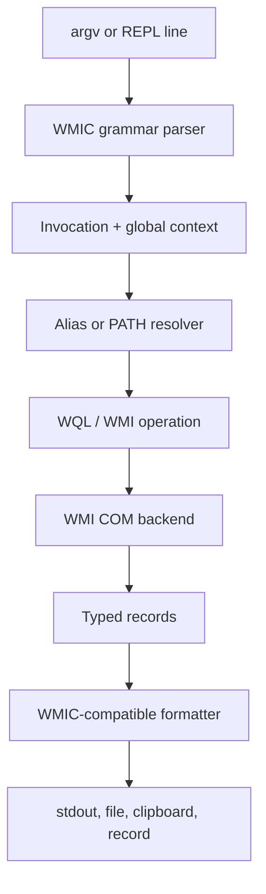

# Architecture

The implementation keeps observable command behavior separate from Windows access:

- `cli.rs` parses WMIC's case-insensitive and colon-valued grammar without using a conventional
  POSIX CLI parser.
- `aliases.rs` contains the bootstrap en-US alias registry. A later phase should load installed
  role definitions from `ROOT\Cli`, using this table only when those definitions are absent.
- `engine.rs` converts parsed read operations to WQL and exposes a backend trait for deterministic
  tests.
- `windows_backend.rs` is the only module coupled to COM/WMI.
- `output.rs` owns observable formatting, including WMIC's unusual `CR CR LF` text line ending.
- `tools/differential.ps1` compares a release binary with the legacy executable on the same VM.

Mutating verbs are parsed but deliberately rejected before touching WMI. Implementing them safely
requires exact tests for instance selection, parameter coercion, confirmation prompts, return
value rendering, and exit codes.
